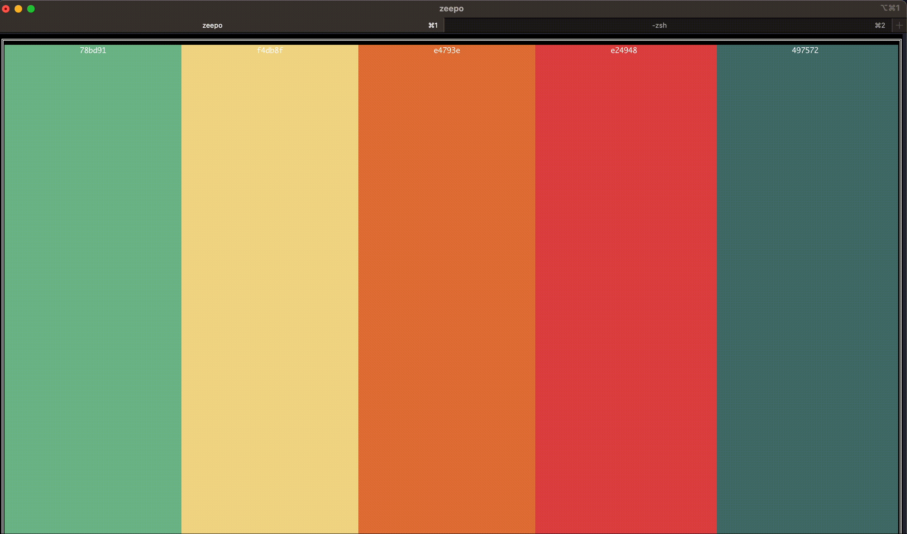

# Terminal Color Palette Generator

This program will generate color palette's from [colormind.io](http://colormind.io/) using the [tview](https://github.com/rivo/tview/tree/master) library.



# Installing

## macOS

```bash
brew tap radical-egg/zeepo
brew install zeepo
```

## Building

```
git clone https://github.com/Radical-Egg/zeepo.git
cd zeepo

go build cmd/zeepo/zeepo.go

./zeepo
```

# Usage

- Press the enter key to generate a new color palette.
- Press Tab to display help menu
